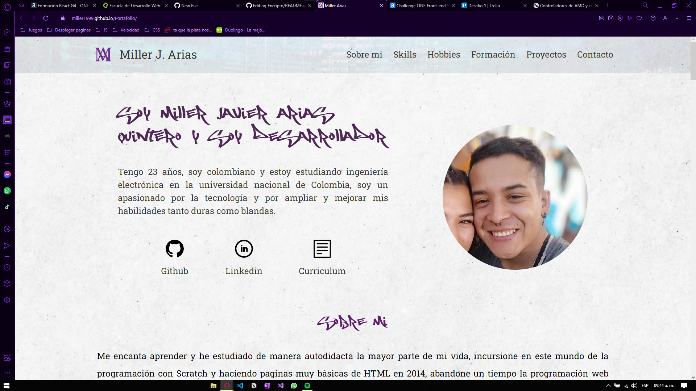
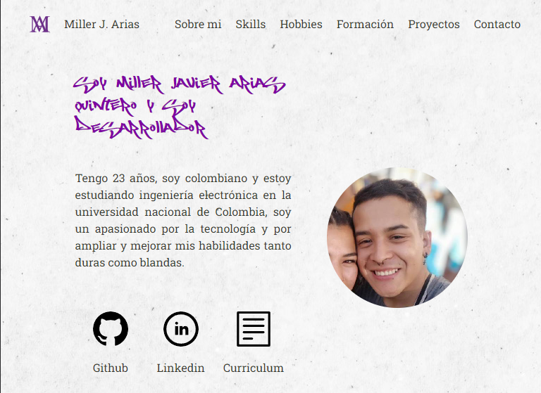
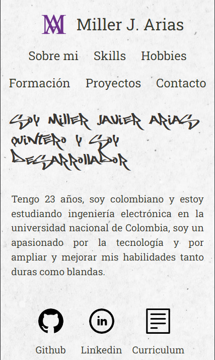

<h1 align="center" id="title"> Portafolio </h1>

Proyecto mas importante ya que muestra toda mi trayectoria como desarrollador, hecho como primera tarea para la especializacion de Alura Oracle Next Education, se actualiza a medida que se completan proyectos

## Tabla de Contenidos
- [Portafolio](#title)
  - [Tabla de Contenidos](#tabla-de-contenidos)
  - [Demostraciones](#demostraciones)
  - [Tecnologias usadas](#tecnologias-usadas)
  - [Recursos Utiles](#recursos-utiles)
  - [Licencia](#licencia)
  - [Autor](#autor)
### Demostraciones
La pagina se puede ver en el link a continuacion
## [Portafolio](https://portafolio-miller-arias.vercel.app/) 
Las diferentes pantallas de la pagina son:
### Escritorio

### Tablet

### Celular

Tambien puedes ver el funcionamiento [aqui](https://www.youtube.com/watch?v=vrOMlrV89jU)
### Tecnologias usadas
Cada uno de los proyectos ha sido desarrollado completamente en 
- HTML
- CSS
- JS
### Recursos Utiles
Durante el proceso se ha utilizado la documentacion oficial de javascript
- [Mozilla for Developers](https://developer.mozilla.org/en-US/docs/Web/HTML)
### Licencia
> This project is licensed under MIT.
### Autor
Hecho por [Miller1999](https://github.com/Miller1999)
